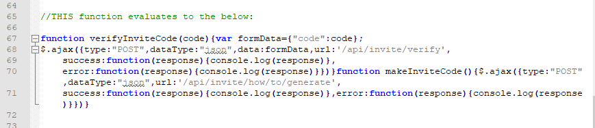
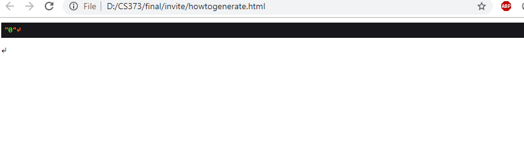
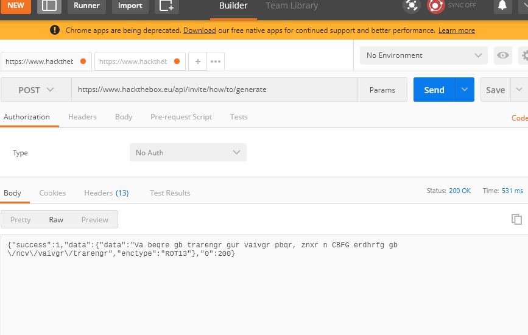
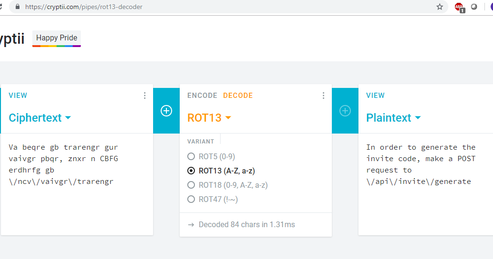
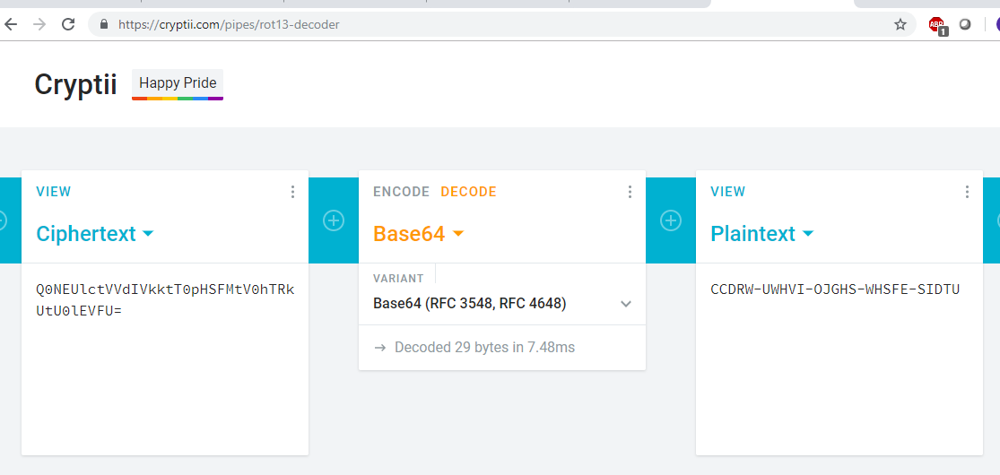

## Obtaining the Invitation Code

I started by examining the webpage source of the invite page with Chrome.  There was one javascript file, inviteapi.min.js that seemed unusual.  It appeared to be a bizarre function wrapped in an eval statement.  I copied this function definition and pasted it into the javascript console and then executed it with the parameters in the eval statement.  The result was a new function definition:

When I executed this function in the console, it generated a long string of html.  I saved this as an html file and opened it in the browser.  This just displayed some random characters.  I spent some time examining this more closely, but did not find anything useful.

I returned to the previous function definition which contained several AJAX calls to post routes.  I used a tool called postman to generate a post request to these two routes.

The post request to /api/invite/how/to/generate returned a string with encoding type ROT13

I used a decoding website to decode this and it said to use a new post route

This post route then returned another encoded string, but it didn't show the encoding type.  

I tried the decoder website again and went through the available decoding schemes to see if any would work.  The Base64 decode displayed a string which looked like a real result, so I tried entering it on the website and it was valid.

