## Obtaining the Invitation Code

I started by examining the webpage source of the invite page with Chrome.  There was one javascript file, inviteapi.min.js that seemed unusual.  It appeared to be a bizarre function wrapped in an eval statement.  I copied this function definition and pasted it into the javascript console and then executed it with the parameters in the eval statement.  The result was a new function definition:

When I executed this function in the console, it generated a long string of html.  I saved this as an html file and opened it in the browser.  This just displayed some random characters.  I spent some time examining this more closely, but did not find anything useful.

I returned to the previous function definition which contained several AJAX calls to post routes.  I used a tool called postman to generate a post request to these two routes.

The post request to /api/invite/how/to/generate returned a string with encoding type ROT13

I used a decoding website to decode this and it said to use a new post route

This post route then returned another encoded string, but it didn't show the encoding type.  

I tried the decoder website again and went through the available decoding schemes to see if any would work.  The Base64 decode displayed a string which looked like a real result, so I tried entering it on the website and it was valid.

## Challenge 1
## Unity Challenge
#### Category: Stego
#### Points: 20

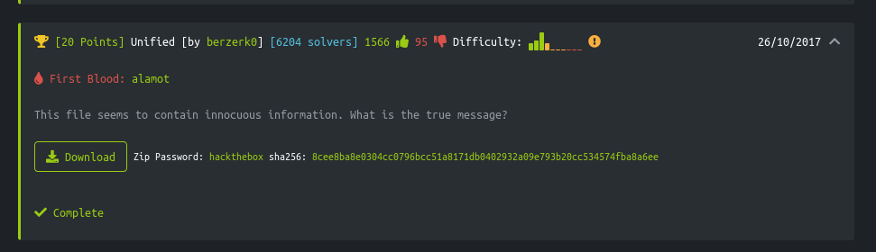

The Unity challenge gave me a text file with several encoded strings inside.  I needed to find an encoded flag token inside this file.

This was my first challenge and I before I began, I set up an environment for my Hack the Box work.  I created a Kali Linux VM that I ran on my windows laptop in Hyper-V because this seemed to be recommended in the HTB forums and it came with a number of security tools built-in.

I downloaded the file for the unity challenge and opened it in a text editor.

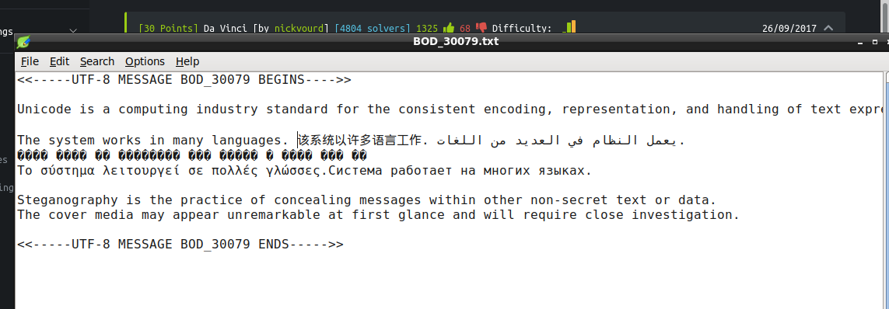

The file description says that the message is UTF-8 and there are multiple phrases in different languages in the main body of the file.

Pasting the foreign text into google translate, returned a phrase but no flag.

At this point, I wanted to inspect the hex values of the file because that was always the starting point for static file analysis in the class labs. I attempted to find FileInsight to install it on my local machine, but it no longer appeared to be available from McAffee. I spent some time researching hex text editors for linux and eventually found on the HTB forum website that people recommended using the 'decode' functionality in Burp Suite.  This program came installed in my Kali Linux distribution.

I used Burp Suite and pasted all the foreign text into the decode tab.  

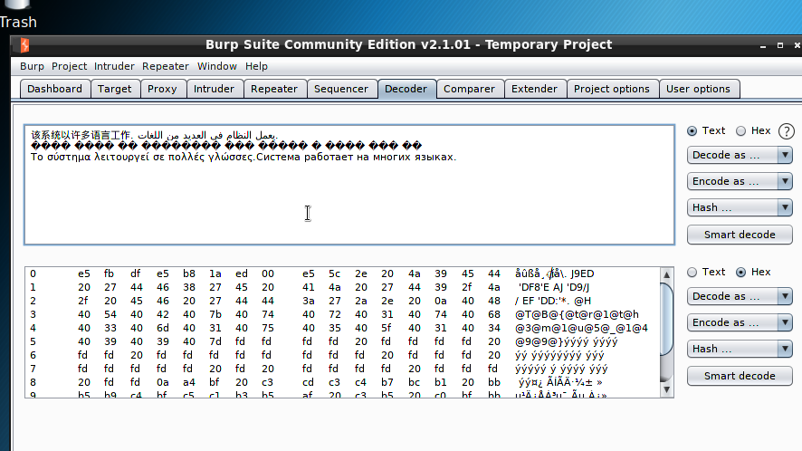

The characters when decoded and represented in ascii showed a HTB{} pattern in the middle section.  This was coming from the blacked out/invalid unicode characters.  

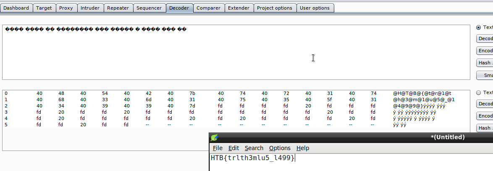

It looked like this was the flag token but with the @ character in between each valid character, so I created a string by removing the @ characters.

This solved the challenge

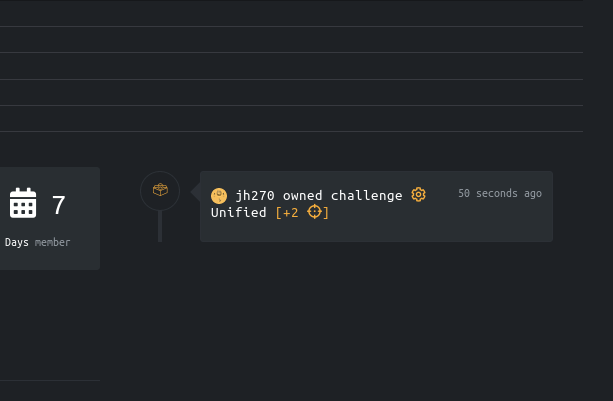

#### Thoughts about the Unity Challenge

The biggest difficulty for me with the Unity challenge was just figuring out the correct tool to use.  The file that I had to decode was relatively small and so there was a fairly small set of possibilities that I needed to check out.  After completing the invite challenge, I felt more comfortable dealing with encodings and knowing that there were many tools available which could decode characters easily.  When I started the challenge, I quickly knew that trying to see the hex values would be a good first step, but finding the correct tool to do this easily took me a lot of time. There didn't seem to be many GUI hex editors for linux and I tried a command line hex editor which was difficult to use as a beginner.  Once I figured out that I could use Burp Suite, I found the flag token quickly.

## Challenge 2
## Lernaean Challenge
#### Category: Web
#### Points: 20

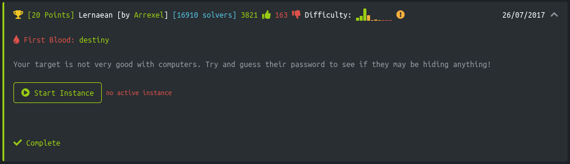

The lernaean challenge had a password login webpage and I had to crack the password for the webpage.  To accomplish this I first tried to use the web password cracking tool hydra, which was a default tool installed in my Kali Linux VM.  It seems like the hydra tool is capable of doing multiple types of network password cracking but I was specifically interested in http website forms because the webpage appeared to use a html form request to pass the password to the server.

I used the firefox inspection tools to check the post request and saw that the post parameter was named 'password'.

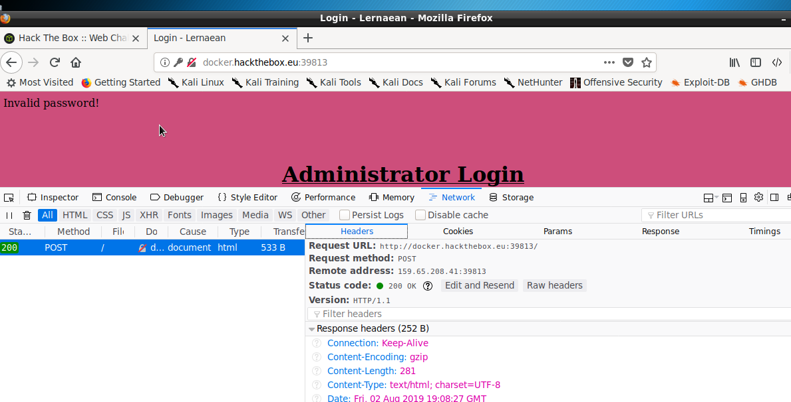

I found some documentation online and looked at some examples of the command parameters to use.  I called the hydra program with parameter options which used the password list rockyou.txt.  Kali linux has a directory of various password lists in a shared folder and this was one of the lists that people online seemed to recommend using.  I specified in the parameters to use this list as the request body paramter 'password' and I indicated that a failed login would have the string 'Invalid' in the html.  I knew this was the case because when I tried to login previously it displayed an 'Invalid password' message.

It took multiple attempts to get this to run as there were initial problems in the syntax.  When I finally got it to run correctly it displayed a successful password match of 'leonardo'.  

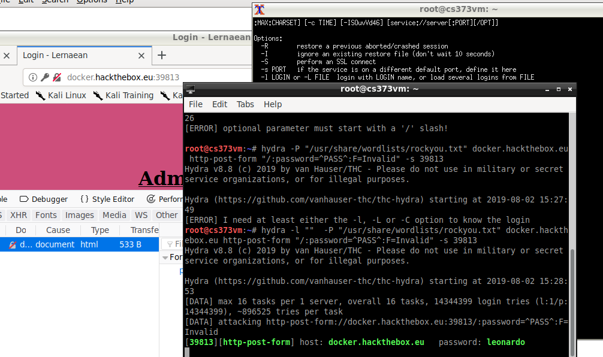

When I tried to log in using the webpage and this password, it did not seem to work.  I got this page displayed that I was "too slow".

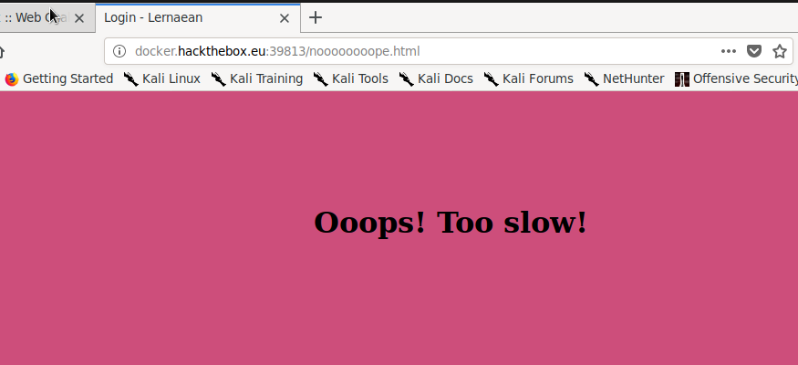

I didn't really know what to do at this point.  I thought at first that there might be some time limit, so I tried restarting the challenge and using hydra again and logging in again more quickly.  But this resulted in the same issue.

I seemed stuck at this point, so I checked the HackTheBox forum for some hints.  People suggested intercepting the response using Burp Suite.  I had not used this tool for this purpose previously, but I found a youtube video demonstrating how to set up the configuration.  I had to change the settings in firefox to use a specific port on localhost as a fixed proxy for incoming and outgoing network requests and responses.

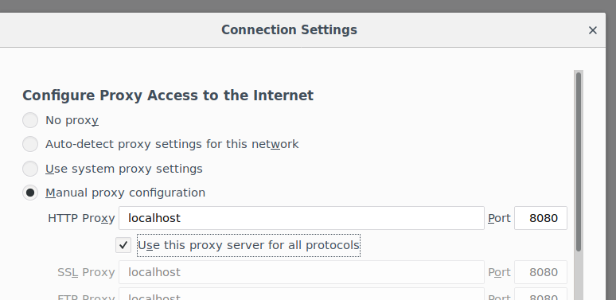

Then I opened up Burp Suite and used the "proxy" tab.  This would intercept the request or response before reaching the browser and I could view it or forward it on to its destination.

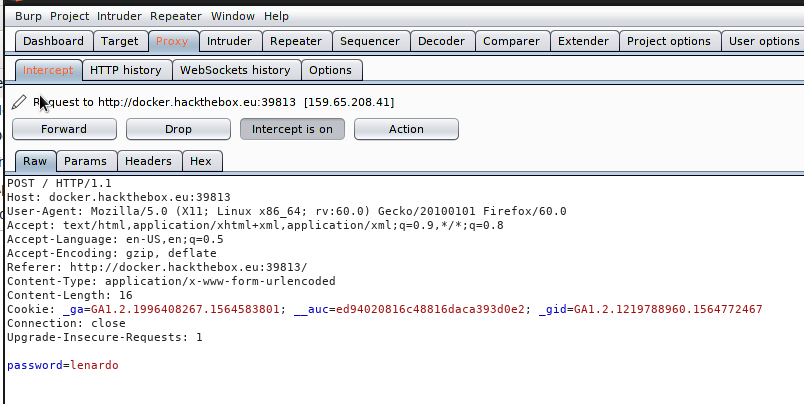

The response packet below showed the HTB solution flag in the html in a h1 tag with the color altered so it wouldn't show on the page.

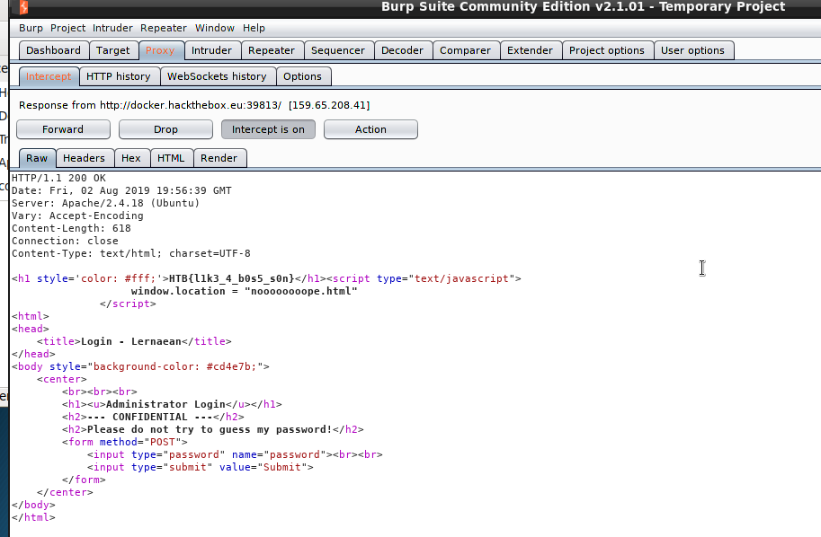

This was in the html, so I think I could have spotted this by inspecting the page in firefox as well, and intercepting the page with Burp wasn't necessary.  Anyway, this HTB flag solved the challenge.

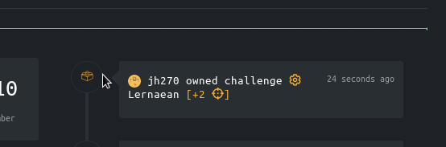

#### Thoughts about the Lernaean Challenge

Before on starting on the Lernaean challenge, I attempted another challenge which involved using a password cracker.  That forced me to spend some time figuring out how these tools work.  In the previous challenge I was trying to crack the password for a zip file and I was using a tool called John the Ripper which was installed on my Kali VM. From what I have been able to tell, these tools work either via a brute-force string generation process or by using a list of commonly used passwords.  The brute-force method of trying out permutations of random characters appears to take a long time, so people generally attempt to use the password lists at least for the first attempts.  Kali Linux comes with some of these lists by default and there are additional ones available on the internet.  There also seems to be lists of password hashes which can be used in a similar way.  I haven't used the hashes personally, but my understanding is that they are different cryptographic hashes of password lists.  In the real world, passwords would be stored in a hashed form and using the lists of pre-hashed passwords would let you crack the decoded form of these hashed passwords.

It took me some time to fiddle with these password cracking tools in order to get them to work, but once I figured it out it was fairly easy and they were able to crack the password in the Lernaean challenge very quickly.  I was actually surprised how easy it was to crack a password.  This particular password was relatively simple and did not have the complexity of special characters and numbers as many systems require, but still I was suprised it could be cracked within 30 seconds on a low performance laptop.

In addition to the password cracker, I ended up learning how to intercept network packages using Burp Suite for this lab. It seems like a useful tool.  The network request intecepting kind of reminds me of using WireShark to examine network traffic, except it actually stops the request mid-transit and lets you inspect what is going on before it is delivered to the destination.

Overall, this challenge was somewhat enjoyable and I felt like I learned a bit more about commonly used security tools.

## Challenge 3
## Emdee Five for Life
#### Category: Web
#### Points: 20

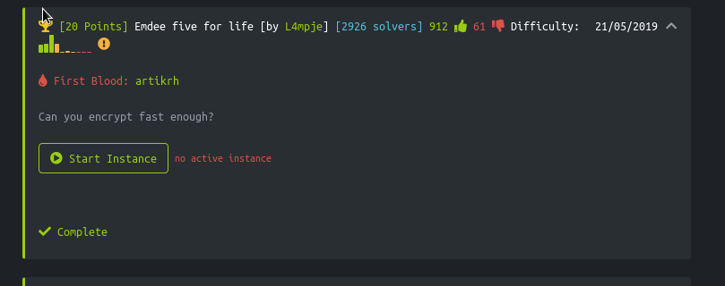

This challenge starts with a clue about encrypting fast enough.  When I opened up the link it displays a string that I need to encrypt and a form to submit the encrypted result.  I used the firefox tools to inspect the elements in the page.  There was no client side scripting, it was only html and it was using a standard html form to post the result to the same route.  I found a website that would encrypt the string using md5 and pasted the result into the form.  The result was a message that I was too slow.

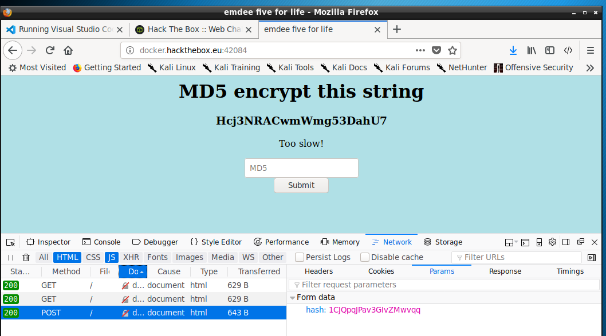

I inspected this response and there was nothing unusual.  The post route had sent the inputted string as a parameter with the key of 'hash'.  The response was html with no client side javascript.  I repeated this several more times to see if I could complete the task faster, but I always ended up with the same result.

I had used Burp Suite to intercept web traffic in a previous challenge, so I tried to use it again.  I changed the firefox settings to use a static localhost proxy so that BurpSuite would intercept the requests an responses.  This ended up providing me no more information than I had already seen in by inspecting the traffic in firefox.

At this point I was unsure what to do next, so I checked the HacktheBox forum and the hints suggested that I needed to script the process in order to encode the string and send the response in a quick enough time.  I started looking at python's request library and built up an initial script using the request library to make the get and post request and using the lxml library to parse the html in the get response..

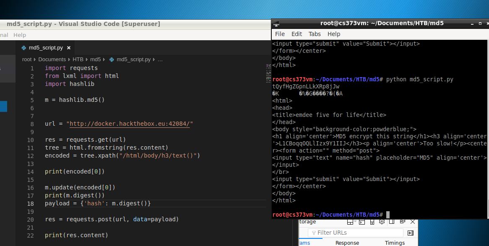

The script sends a GET request, parses the html response and retrieves the string to be encoded which is inside an h3 tag.  It then uses hashlib to encode the string and sends the post request with the encoded string.  The result didn't seem to be working.  It still was saying "too slow".  I went back and spent some more time looking at the request library and eventually realized that I probably needed to use the sessions class from the library.  The website was changing the string each time I reloaded it, so it must have been maintaining some state information in order to know if the encoded string was correct.  I think using the session class instead of a plain request would keep a cookie attached to my requests.

I made this change to the code and it still was not working.  I eventually figured out that I was not calling the correct md5 encoding methods correctly.  I needed to convert the initial string to unicode first.

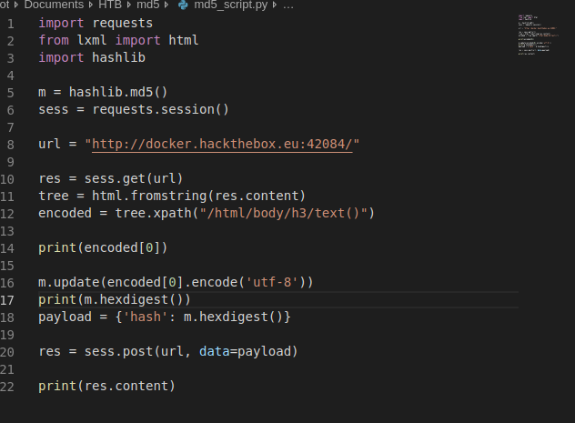

With these changes made I finally got a result with the token.

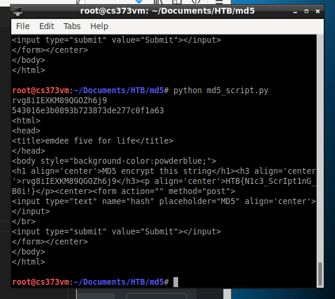

This solved the challenge

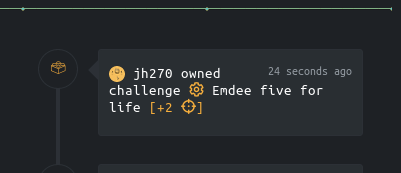

#### Thoughts about the Lernaean Challenge

This challenge turned out to mostly involve scripting.  I am a novice at python, so I found it a useful exercise to practice my python programming and use some python libraries that I had not used before.  Overall, I'm not sure how much of a realistic hacking challenge it actually was.  I am not aware of any sort of website vulnerabilities that can be exploited by sending a response very quickly.  On the other hand, there are security concepts like website fuzzing which involve scripting requests to websites, so that many requests can be made in an automated manner.  Maybe this was the purpose this challenge was teaching.

#### Concluding Thoughts about Hack the Box

I found this final project to be very challenging at first.  These challenges have a particular style to them where the beginnner ones are not necessarily realistic exploits, but meant to be fun little puzzles that force the person to learn a new tool or skill.  I think that I was able to learn several useful tools.  I think these challenges also presented topics which were different than presented by the McAffee folks in the lectures.  My first instict when doing the HTB challenges was to try to use a tool or technique from the class, but I ultimately found it more useful to find other tools and techniques.  This is probably because the field of computer security is so large and changes so rapidly that there is a lot more out there to learn in addition to the lecture materials.