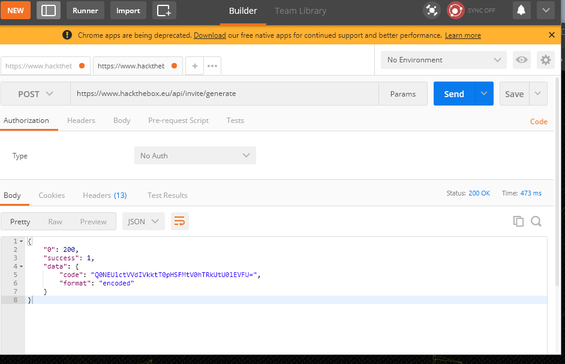
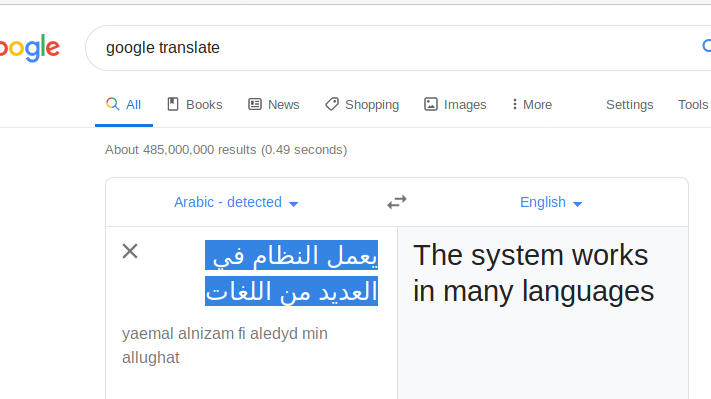

## Obtaining the Invitation Code

I started by examining the webpage source of the invite page with Chrome.  There was one javascript file, inviteapi.min.js that seemed unusual.  It appeared to be a bizarre function wrapped in an eval statement.  I copied this function definition and pasted it into the javascript console and then executed it with the parameters in the eval statement.  The result was a new function definition:

When I executed this function in the console, it generated a long string of html.  I saved this as an html file and opened it in the browser.  This just displayed some random characters.  I spent some time examining this more closely, but did not find anything useful.

I returned to the previous function definition which contained several AJAX calls to post routes.  I used a tool called postman to generate a post request to these two routes.

The post request to /api/invite/how/to/generate returned a string with encoding type ROT13

I used a decoding website to decode this and it said to use a new post route

This post route then returned another encoded string, but it didn't show the encoding type.  

I tried the decoder website again and went through the available decoding schemes to see if any would work.  The Base64 decode displayed a string which looked like a real result, so I tried entering it on the website and it was valid.

## Unity Challenge
#### Category: Stego
#### Points: 20

The Unity challenge gave me a text file with several encoded strings inside.  I needed to find an encoded flage token inside this file.

This was my first challenge and I before I began, I set up an environment for my Hack the Box work.  I created a Kali Linux VM that I ran on my windows laptop in Hyper-V because this seemed to be recommended in the HTB forums and it came with a number of security tools built-in.

I downloaded the file for the unity challenge and opened it in a text editor.

The file description says that the message is UTF-8 and there are multiple phrases in different languages in the main body of the file.

Pasting the foreign text into google translate, returned a phrase but no flag.

At this point, I wanted to inspect the hex values of the file because that was always the starting point for static file analysis in the class labs. I attempted to find FileInsight to install it on my local machine, but it no longer appeared to be available from McAffee. I spent some time researching hex text editors for linux and eventually found on the HTB forum website that people recommended using the 'decode' functionality in Burp Suite.  This program came installed in my Kali Linux distribution.

I used Burp Suite and pasted all the foreign text into the decode tab.  

The characters when decoded and represented in ascii showed a HTB{} pattern in the middle section.  This was coming from the blacked out/invalid unicode characters.  

It looked like this was the flag token but with the @ character in between each valid character, so I created a string by removing the @ characters.

This solved the challenge

#### Thoughts about the Unity Challenge

The biggest difficulty for me with the Unity challenge was just figuring out the correct tool to use.  The file that I had to decode was relatively small and so there was a fairly small set of possibilities that I needed to check out.  After completing the invite challenge, I felt more comfortable dealing with encodings and knowing that there were many tools available which could decode characters easily.  When I started the challenge, I quickly knew that trying to see the hex values would be a good first step, but finding the correct tool to do this easily took me a lot of time. There didn't seem to be many GUI hex editors for linux and I tried a command line hex editor which was difficult to use as a beginner.  Once I figured out that I could use Burp Suite, I found the flag token quickly.
