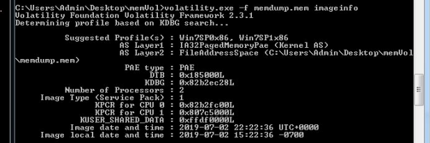
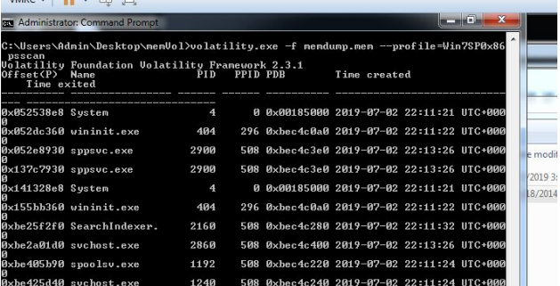
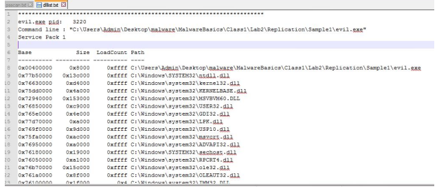

##Summary of Week 2 Content

### Forensics
Forensics involves collecting evidence.  The job of the forensics investigator is to determine what happened on the machine.  It has typically involved examining machines collected from locations, but recently 'live forensics' or the examination of the working machine in place has become more common.  Live forensics enable the researcher to do a memory dump and analyze what is happening in memory.  This would not be possible if a machine was shut down and transported for analysis.

The lecture mention four important principles for forensics:
1. Minimize data loss
2. Record Everything
3. Analyze all data collected
4. Report Findings

When recording evidence you should start with the time and system time.  It is important to have proper time recordings so that a timeline of events can be reconstructed.

Triage is a concept mentioned in the lectures where multiple sources of evidence such as registry values and log files are examined and each supports the same conclusion.  If you want to investigate a particular question, it is good to examine all evidence which might determine the answer, and all should be consistent.

Incident Response (IR) is the methodology for a team to respond to an ongoing attack.

DMZ is a zone in the corporate network that is between the internal network and the internet.  This is where applications which need internet access would reside and there would be firewalls on both ends of the zone.

A typical incident might involve the attackers penetrating the outer firewall, infecting a device in the DMZ, and then further attempting to penetrate the inner firewall to access the internal network.  The incident response would need to collect log data from all these devices and synchronize them.

The order of volatility - information which is more volatile, should be collected first.  System memory is the first item to be captured, along with any other data that would be erased when the system shuts down.

#### Forensic Tools:
##### FTK Imager - 
 - The 'capture memory' button creates a memory dump file. This is all the raw contents of memory, which includes the memory used by the tool itself.
 - 'Add evidence item' opens a read-only view. For example, adding the physical drive will display all contents of the drive without copying or modifying
	root\$MFT is the master file table
 - 'Create disk image', select disk, select output'raw' 
 
 
 Memory dumps can show almost all activities which are occuring.  It is one of the most useful analysis techniques because it has so much valuable information.
 
##### Volatility -
 This runs from the command line. It is easiest to put the .exe file and the memory dump file in the same folder.  Then run volatility on the memory dump with some plugin option. These are some plugins which I ran:
 
 imageinfo
 This is useful for identifying the profile.  In this case Win7SP0x86
 Then other plugins can be run with --profile=Win7SP0x86 attribute
 
 
 
 psscan
-this lists the processes which were running on the system 
  
 
 
 dlllist <pid>
 this displays the dlls called by a particular process identifying
  
 
 
 netscan
 this displays network activity
 
 deskscan
 shows the different desktops which the processes are assigned to
 
 getsids
 displays which user rights the processes are running under
 
 
 timeliner --output=body
 creates a timeline of events including processes and network activity
 
 mftparser --output=body
 outputs master file table $MFT
 
##### Windows Registry
Hierarchical database storing configuration data for users, devices, and more.  It contains tons of information and timestamps recording what was accessed, by whom, and when.
Two 'real' hives: HKEY_USERS (HKU) and HKEY_LOCAL_MACHINE (HKLM)
RegEdit

Within the registry there are common locations for malware such as: autorun, MRU lists, USB devices, IE history

Other forensics locations:
Browser logs
Anivirus logs
Windows prefetch folder
System Restore Points

Data Recovery/Data Carving-
Deleted files remain on disk until they are overwritten.  This data can be recovered via a special program which scans the disk for file header and footers.  The header identifies the start of the file and the type of the file.

##Thoughts and Reflections
I found that there were a lot of similarities between the lab and challenge component of week 2 and the assignment of week 1.  Week 1 covered malware analysis, which involves allowing malware to run in an isolated environment, and watching the actions taken by the malware.  Week 2 covered forensics, which is more for examining an already infected machine.  The forensics toolkit is a bit different, and involves copying memory and examining logs to build a historical timeline of events.  Interpreting the timeline of events seemed similar to examining the real-time actions of dynamic analysis, because it similarly involves looking at processes, network activity, and other system logs.

