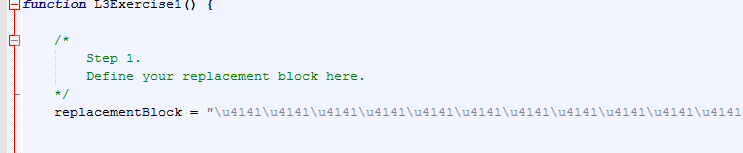

# Week 4 Summary

This week was focused on software exploits.  To examine the behavior of several example exploits, the WinDbg debugging tool was used.  Here is a summary of some useful commands for WinDbg.

## WinDbg

#### Basic memory commands

`lm` lists modules

`lmf` finds a module

`bp` breakpoint

`bl` breakpoint list

`dd` displays a dword of memory

`u` unassembles memory

`.hh` help

`.formats`

`dv` shows local variables

`db` shows bytes and ascii string representation 

`da <value>` show ascii string

`du` unicode strings

`t` step into

`p` step over

`g <address>` goes to address

`!teb` stack

`!peb` heap

`!address`

`k` shows stack

### Exploits

The exploits demonstrated in the labs are considered to be memory corruption vulnerabilities.  The labs covered two types of memory vulnerabilities: stack overflow and user after free.

Memory Corruption - 
	* vulnerabilities which depend on unexpected user input

Stack Overflow -
	* This is a type of memory corruption vulnerability.  By writing to memory in the program's stack, it is possible to overwrite a return address and control program execution

Use After Free -
	* Memory that is allocated is freed and replaced with a malicious object which the program then uses.

### Labs

Lab 1 was a walthrough of using WinDbg to examine a running process, set a breakpoint and then analyze the memory and register contents at the breakpoint.

Lab 3 showed a Use-After-Free vulnerability which exploited the stack.  I attached the IE process to WinDbg and triggered the crash.

This showed that eax was pointing to heap memory.  The ` !heap -p -a eax ` commmand then showed the stack trace associated with this memory address.

We need to figure out the size of the allocation, but the block is free at this point, so by examining the function that previously allocated this memory and examining the associated disassembly, we can identify a breakpoint.  

After setting the breakpoint and rerunning the program, at the breakpoint the heap memory address is the third parameter of the function call, so it is the third item in the stack.  By printing the stack, we can see the heap memory address.

Running ` !heap -p -a ` on this memory address then will display the allocation size.

Now that the size of the memory allocation is known, the replacement block of memory can be written to point to the shell code.

I created a replacement block string to fill the memory

And enabled the low fragmentation heap by allocating 18 objects of a small size.

I then uncommented out the provided sections of the code and relaunched the program.

### Thoughts and Conclusions	

I wasn't able to fully get the heap exploit to work and launch the calculator.  I seemed to have gotten close, but I believe that there is still an issue with the way in which I am trying to launch the shell program.  The process of trying to get it to work was still useful though, and I feel that I have a better understanding of how the stack and heap exploits work, even if I cannot build an exploit myself.

One thing that I tried to take away from this week was how applications create paths for exploitation and how from a defensive perspective I should be writing my applications as a developer.  This wasn't directly discussed in the lecture, but as I have thought about it more, the stack exploit used a poorly written piece of code which used memcpy.  The memcpy section did not validate the user input or length of input and so it allowed the attacker to have control over stack memory.  The second exploit relied on a provided activeX file which had a bug that would try to read deallocated stack memory in certain instances.  This would simply cause the program to crash normally, but an attacker could use this bug to read and execute malicious code.  In the real-world, instead of activeX, this situation could occur from a bug in the browser itself.

Using C/C++ in previous courses showed that memory bugs are very common in these languages.  It's very easy to try to read or write to incorrect memory addresses due to pointer errors and memory allocation errors.  These were always annoying issues to deal with as a developer, but this week showed that these are also potential security vulnerabilities. 
