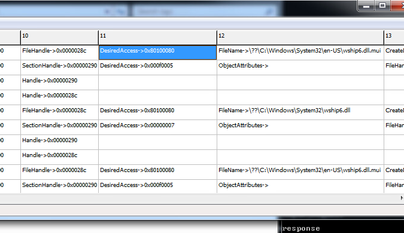
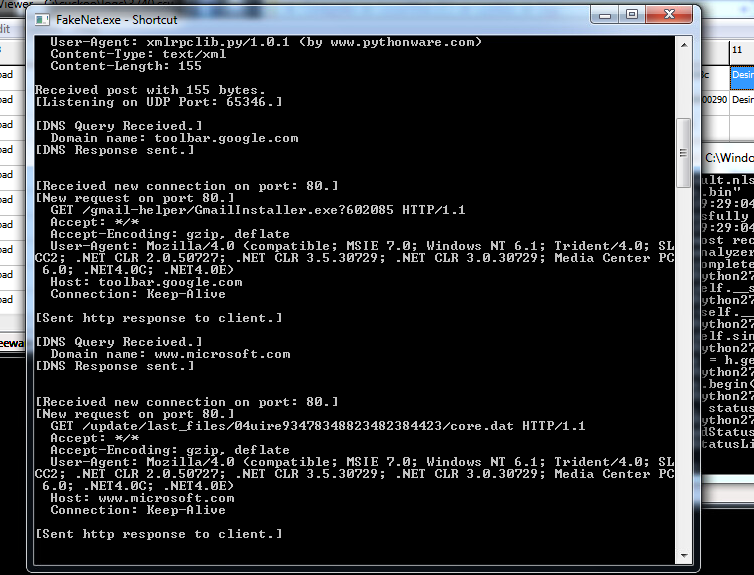
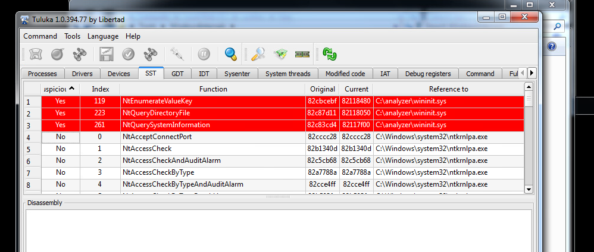
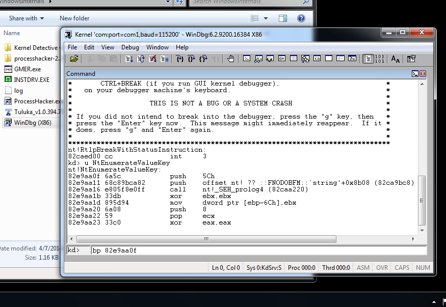

### Agony Lab

I ran used cuckoo and fakenet to analyze the Agony malware.  After analyzing the resulting logs, some of the key points that I noticed were that

1. The malware is generating files in the SYSTEM32 directory with names such wship6.dll, wshqos.dll,

2. It also appears to be altering TCP/IP settings in the \Tcpip\Parameters\Winsock file.
3. It creates a file in a system device folder NifsPvd
4. There are lots of changes made to registry files.

5. Fakenet shows that it makes two network requests.  One involves a gmail-helper installer, the other seems to be a windows update file request.

The class lab debrief showed some elements that I had missed.  The Tuluka tool shows a suspicious wininit.sys file that was created in the directory where cuckoo was running.

This rootkit has hooked several system calls that deal with querying the file directory.  This has allowed the malware to hide the wininit.sys file from normal viewing and from anti-virus.

#### Hooking
Hooking involves inserting code into a processes memory which alters the behavior of the code. It typically would involve a jmp instruction at the beginning of the program code which causes malicious code to be called first, whenever the infected program is called.  There are multiple ways of implementing hooks.  They can be in the kernel boundary or outside it.  Since hooking often involves adding calls to malicious code in user memory, detection can often be done by examining process memory locations or process attributs.  In the lab, one malicious process was running without a name, but with execute permissions.  Another example in the lab was where a process table was altered to execute code in user space instead of kernel space.

#### Lab 3

Lab 3 introduced the concept of debugging the windows kernel of one system by running WinDbg on a separate system.  This was a necessary step to examine the working of the rootkit in real time.

We knew that the malware was intercepting NTEnumerateValueKey, so a breakpoint was set on this memory location. When the system stopped at the breakpoint, the call stack did not show the malware interception.  To identify the malware hooking this process, it was necessary to walkthough the assembly of NTEnumerateValueKey with the debugger and identify when it was jumping and returning from the malware.
After identifying these two memory locations, then it is possible to develop a patch for this malware by replacing the jump to the malware with the return location.

#### Bootkits

Bootkits are similar to rootkits in that they provide a means of stealth and are difficult to detect.  Bootkits involve manipulations of the boot sectors.  They have historically been around longer than rootkits.  Rootkits are a relatively more recent threat.  Bootkits still exist, for example, there are ransomware malwares that lock the user's system from the boot sector.

#### Thoughts and Conclusions

I found this week's materials to be very challenging.  I attempted each of the labs presented in the lectures, but was not able to successfully complete many of the labs myself without watching the lab walk-through. That being said, I think that I did learn the important concepts from this week.  First, rootkits act at a very low level, whether by altering kernel tables, inserting code in process memory, or other techniques.  This is what makes detection difficult and it also makes patching and removing the malware difficult.
In previous weeks we analyzed malware behavior via static analysis and dynamic analysis tools.  This week added another technique which was analyzing malware through kernel debugging from a separate machine.  For malware which successfully hides from tools on the same machine, debugging from a separate machine provides a new technique to examine this type of rootkits.
