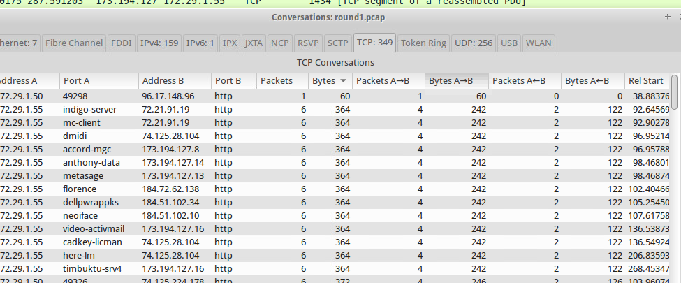
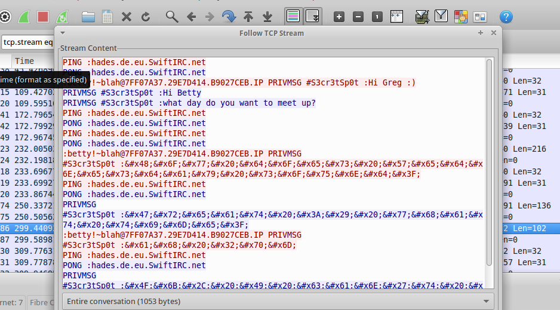
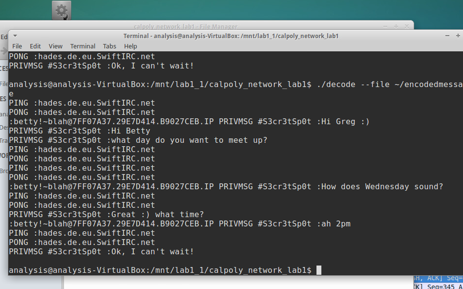

## Week 6, Network Security

One part of making a network secure is the overall architecture.  The design and the machines included in the network architecture can make the network more resistant to attacks or at least provide a series of barriers that the attacker needs to overcome.  By having multiple layers of security, the attacker will be slowed down and if you are monitoring activity in the network, then you may be able to detect the attacker before any data is stolen.

Networks generally have a DMZ that is the zone which is in contact with the internet.  There would be firewalls on both sides of the DMZ, so the attacker would need to penetrate two layers of security to get to the internal network.  Business critical data would be protected behind another layer of security.

Firewalls provide security through a whitelist approach.  These whitelists would specifically enable certain types of traffic and would drop all other traffic.  Developing the whitelists requires understanding the details of the network's users and machines so that all the valid traffic can be identified and whitelisted.

IPS machines provide intrusion detection via signature based matching.  These types of machines examine network traffic for packets which match known malware signatures in a way similar to AV software.  These are commonly used in addition to firewalls as barriers to network security zones.

There are a number of different attacks which involve networks.  A man-in-the-middle attack would involve an attacker intercepting and reading or altering traffic.  A DOS attack involves massive amounts of simultaneous requests to shut down a network service.

##### Wireshark Lab

For the wireshark lab, I needed to use wireshark to analyze network traffic and try to find a message establishing a secret meeting.

At first, I started examining TCP conversations to see if anything looked suspicious.  I viewed some of the conversations in more detail which had a large amount of bytes transfered, but when I viewed the details they seemed to be mostly data from someone surfing the web, rather than two people transferring data.

Since this wasn't working, I went back to read the details of the challenge and it mentioned the name 'Betty'.  So, I next searched packets for the string 'Betty'.  When I eventually got the search parameters in Wireshark set up correctly, it found a match in one packet.  I then used the tool to export the http of this conversation and it was a back and forth message of a conversation between the two people.

This was what I was looking for, however some of the messages were encoded.  I saved the message to a file and then used the decode utility that was provided to decode this message.

The results showed a decoded message and showed the meeting is Wednesday at 2pm.

