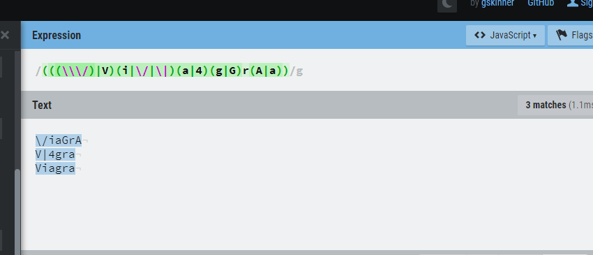
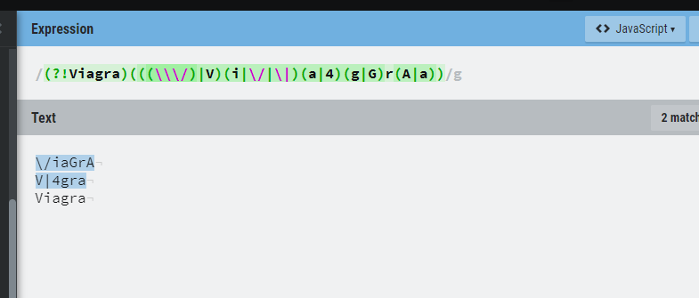

### Week 8 - Messaging Security

#### Email Filtering and Spam

* Snowshoe spam - this is a technique of sending spam from botnets where the spam load is not ramped up quickly like older botnet spam networks.  This is because the security side has gotten better at detecting spam botnets and snowshoe spam networks are better at hiding from the security vendors.

* Phishing vs Spear Phishing - Spear phising is a more targeted phishing attack.  One example of how this is done is the spoofing of a reply-all message

* RBL - realtime blackhole list - This is a blacklist of known spam IP addresses.  Spamhaus is one example

* Email Heuristics - string or regular expression patterns can be used based on common text.  More complex heuristics include comparing multiple features of the message in combination

* 419 Phishing - This is the classic phishing such as an african prince asking form money.  It is illegal.

* Pump and Dump - This involves trying to boost a stock price

SMTP

The SMTP protocol is used for email.  It is very easy to spoof in a variety of ways.  The sender email can be directly changed to a spoof address.  It was not designed to be a secure protocol, so it does not provide any security or validation.

The email header provides information on the messages history, where it originated and how it reached the recipient.

#### Regex Lab

For the lab we needed to develop a regular expression pattern which would match two invalid spellings of the word viagra, but not match the correct spelling.  I used a website tool to test my regex because I did not have the program that was used in class.  

My first strategy was to go through character by character and identify the different ways to represent the V, the different ways to represent the i, etc.  I then assembled this all together and the result was that it matched all invalid expressions but it also incorrectly was matching the valid string.  

At this point I needed to modify my work so that it would not match the correct string.  I searched for some type of AND logical operator, but it seemed that regex does not have an AND operator in the same manner as it has the | OR operator.  After reading some additional resources about regex, I figured out that regex has lookahead expressions and that I could use a negative lookahead expression to accomplish this logical operation.  By adding the negative lookahead at the beginning to not match on the correct string, I was able to successfully complete this.

